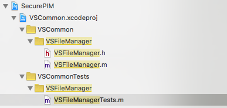
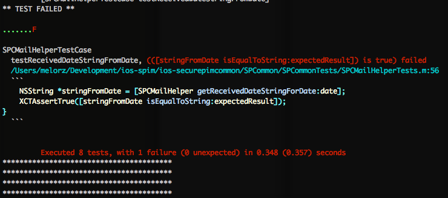
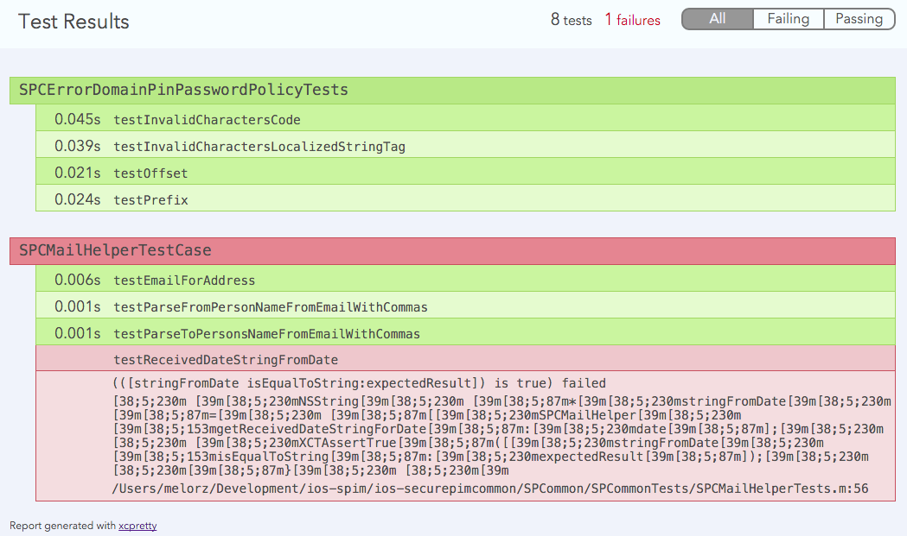

name: inverse
layout: true
class: center, middle, inverse
---
#Unit testing
[SecurePIM iOS]
---
## Why is it so important
---
layout: false
.left-column[
  ## Why is it so important
]
.right-column[
  Changes the way you code.red[*]

- Smaller classes with smaller methods

- Start to take dependencies into account

- Better understanding of single responsability

- More code smells

- Learn how to refactor

.footnote[.red[*] Even when you are not writing tests]
]
---
.left-column[
  ## Why is it so important
]
.right-column[
Forces some good practices

- Think in your code twice

- Easier to UAT

- Better naming

- Avoid code duplication
]
---
template: inverse

## Core concepts
---
.left-column[
  ## Core concepts
  ### - SUT
]
.right-column[
Subject Under Test

- Each test class tests only one real class

- Only test the behaviour of that class.

```objectivec
/* BAD EXAMPLE */
// PersonTest.m
- (void)testWhenMessageIsProvidedItIsBeingSent {
  NSString *message = @"Hello there.";
  NSString *signature = @"Sent with iPhone";
  Phone *phone = [[Phone alloc] initWithSignature:signature];
  Person *person = [[Person alloc] initWithDevice:phone]; // SUT
  
  [person send:message];

* NSString *expected = [message stringByAppendingString:signature];
  STAssertEquals(expected, [phone lastSentMessage], nil);
}
```

]
---
.left-column[
  ## Core concepts
### - Test doubles
]
.right-column[
Replace real objects
- Also called .red[Mock]

- Collaborators

- Goal: isolation, forget about what dependencies do

```objectivec
// TestPerson.m
- (void)testWhenMessageIsProvidedItIsBeingSent {
  NSString *message = @"Hello there.";
  id phoneMock OCMClassMock([Phone class]);
  Person *person = [[Person alloc] initWithDevice:phoneMock];
* [[phoneMock expect] sendMail:message]

  [person send:message];

  [mock verify];
}
```
]
---
.left-column[
  ## Core concepts
### - Test doubles
]
.right-column[
Not a standard
- Dummy
  - Not really used
- Fake
  - Rarely used
  - Custom implementations
  - E.g. InMemoryDatabase, FakeBluetoothDevice
- Stub
  - You set expectations on methods
  - Every other interaction does nothing
  - .red[NiceMock, ClassMock, Mock]
- Spy
  - Record information
  - Behave exactly as the real object
  - .red[PartialMock] .red[(Usually, all mocks can)]
- Mock
  - You set expectations on methods
  - Every other interaction will fail
  - .red[StrictMock]

]
---
.left-column[
  ## Core concepts
### - Test doubles
]
.right-column[
The jargon you really use
- A mock
  - The replacement object

- To stub
  - Set one method of a mock to do/return something

- To expect
  - Explicitly say some method will be called

- To verify
  - Check only the expected methods of a mock were called (or not)

]
---
template: inverse

## Writing tests
---
.left-column[
  ## Writing tests
  ### - Three states
]
.right-column[
- Red
  - Code not compiling
  - Any test is failing
- Green
  - Code works, tests pass
- Blue
  - Refactor, tests pass

1. Write test, make it fail
2. Implement the minimum to pass, KISS
3. [Refactor]
]
---
.left-column[
  ## Writing tests
  ### - Three parts
]
.right-column[
- Arrange
- Act
- Assert

```objectivec
// Arrange
NSString *message = @"Hello there.";
id phoneMock OCMClassMock([Phone class]);
Person *person = [[Person alloc] initWithDevice:phoneMock];
[[phoneMock expect] sendMail:message]

// Act
[person send:message];

// Assert
[mock verify];
```

]
---
.left-column[
  ## Writing tests
  ### - Naming
]
.right-column[

- Create the test file in the same path as the SUT but under the test folder.



- Append exactly "tests" in filename: 
  - Calculator.m -> CalculatorTests.m

- Don't be afraid of long names

- Make readable sentences

- When/Then
  - testWhenSomethingHappensThenResultIsWhatever
  - testWhenEmailIsNilThenLoggedIsFalse

]
---
template: inverse

## The good, the bad and the ugly
---
.left-column[
  ## Writing tests
  ### - Good practices
]
.right-column[
- One assert per test method

- More than one test file per SUT if needed

- One test at a time

- Treat tests as regular code

- Always run all tests before submitting

]
---
.left-column[
  ## Writing tests
  ### - Bad practices
]
.right-column[
- Nondeterministic tests
  - random()
  - Time / date

- Non-isolated
  - Not dependant of other tests
  - Not dependant of state in singletons, etc.

- Ifs, catching exceptions, fors

- Lazy naming

- Try to test everything
  - Obvious things
  - System functionality

]
---
.left-column[
  ## Writing tests
  ### - Ugly practices
]
.right-column[
The ugly mirror

- Reverse code

```objectivec
// SUT: GeometryCalculator.h
- (CGFloat)triangleAreaWithBase:(CGFloat)base height:(CGFloat)height {
* return (base * height) / 2.0f;
}
```
This is bad:

```objectivec
// GeometryCalculatorTest.h
- (void)testWhenHeightHasDecimalsThenAreaIsCorrect {
  CGFloat base = 3.0f;
  CGFloat height = 20.5f;
  GeometryCalculator *geometryCalculator = [[GeometryCalculator alloc] init];

  CGFloat resultingArea = [geometryCalculator triangleAreaWithBase:base height:height];

* CGFloat expectedArea = (base * height) / 2.0f;
  XCTAssertEqual(expectedArea, resultingArea, nil);
}
```
]
---
.left-column[
  ## Writing tests
  ### - Ugly practices
]
.right-column[

This is better:

```objectivec
// GeometryCalculatorTest.h
- (void)testWhenHeightHasDecimalsThenAreaIsCorrect {
  CGFloat base = 3.0f;
  CGFloat height = 20.5f;
  GeometryCalculator *geometryCalculator = [[GeometryCalculator alloc] init];

  CGFloat resultingArea = [geometryCalculator triangleAreaWithBase:base height:height];

* XCTAssertEqual(30.75f, resultingArea, nil);
}
```
]
---
template: inverse

## The script
---
.left-column[
  ## Install and run
]
.right-column[
Install dependency
```bash
sudo gem install -n /usr/local/bin xcpretty
```
Run unit tests
```bash
./BuildScriptsAutobuild/UnitTestRunner.sh
```
- Number of project
- Device
- OS

]
---
.left-column[
  ## Install and run
]
.right-column[
How to get project number
```bash
./BuildScriptsAutobuild/UnitTestRunner.sh --menu-test
```
Device and OS list
```bash
./BuildScriptsAutobuild/UnitTestRunner.sh --device-list-full
```
]
---
.left-column[
  ## Install and run
]
.right-column[
Outcome bash:

Outcome HTML:
.width-100[]

]
---
.left-column[
  ## Setup only
]
.right-column[
Setup the project (do not run unit tests)
```bash
./BuildScriptsAutobuild/UnitTestRunner.sh --setup-only
./BuildScriptsAutobuild/UnitTestRunner.sh --menu-setup
```
It should open the subproject (if it does not, just go to the appropriate folder an open the .xcworkspace file)

]
---
name: last-page
template: inverse

#Unit testing
[SecurePIM iOS]

Slideshow created using [remark](http://github.com/gnab/remark).
